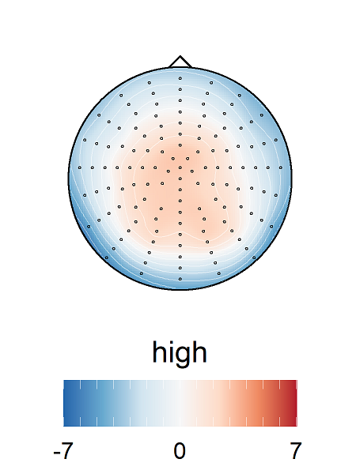

# How to start with Rtopos
Rtopos is a simple function to make ERP topos in R

## Installation
Load the devtools package and download the package
```
library(devtools)
install_github("aziereis/Rtopos")
```
if you don't have devtools already installed, install this first: 
```
install.packages("devtools")
library(devtools)
```

## How to use the function
First you need to shape the data in the format that can be included in the function. 
The data should have the dimensions rows = condition(-levels), columns = condition variables and electrodes. 
See also an example data set included in the package: 

```
library(Rtopos)
View(Rtopos::xdat)
```

To create a topoplot, you have several parameters to set and customize, e.g., the number of channels included, the colour palettes etc. 
Check out the help page for details:

```
?maketopoplot
```

The topoplot function exports a list of ggplot objects, which you can then save or export easily. 

Using the example data set we can create topoplots for the variable "difficulty". It has two levels,  "high" and "low". The default parameter settings will create a topoplot for both and their difference. Which level will be subtracted depends on the previous specified factor levels for the condition (or will create a factor with alphabetical levels, if not specified). (*Note that with the parameter "differencelevel" you can specify the reference for the topoplot explicitly*)

```
tplots <- maketopoplot(Rtopos::xdat, condition = "difficulty", nrchans = 128, extralegend = F)
tplots[[1]] # to see the first condition level "high" 

ggplot2::ggsave("example_topoplot.png", tplots[[1]], width = 3, height = 4)
```



